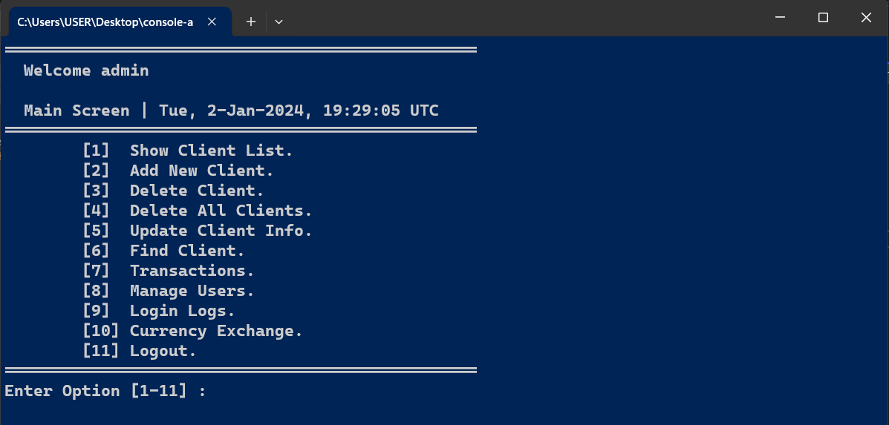
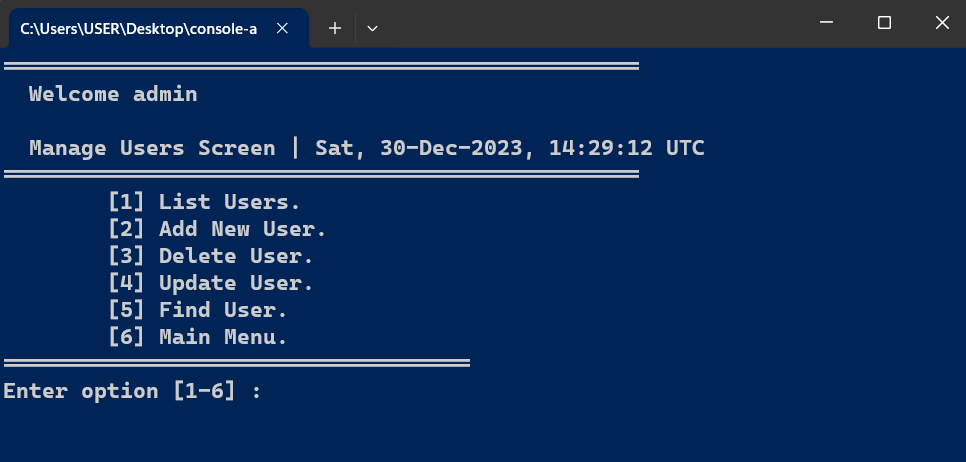
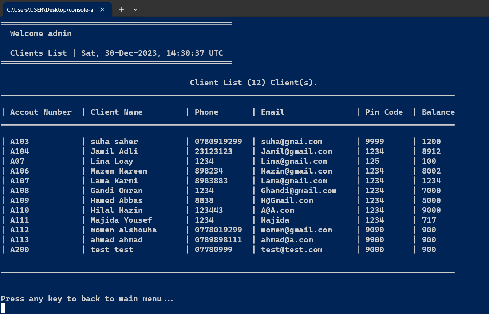
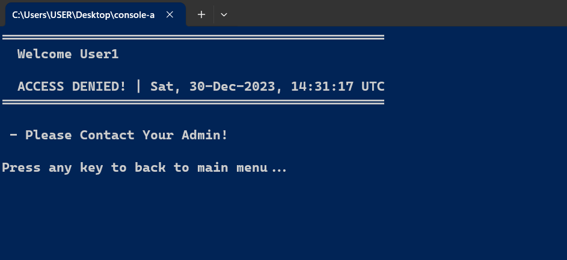
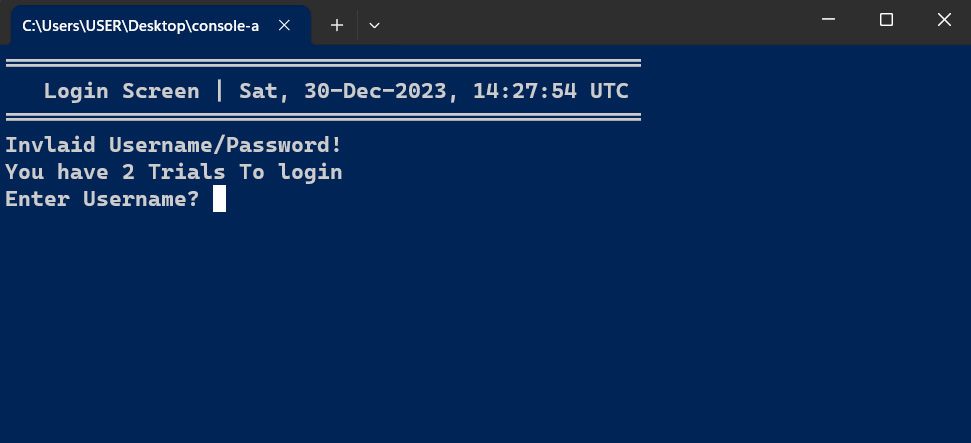

# Bank Console App (C++)

This repository contains a console-based banking application written in C++, emphasizing Object-Oriented Programming (OOP) principles. The application manages client and user data through file handling for CRUD (Create, Read, Update, Delete) operations for both clients and users, integrating simple permission-based functionalities, including a login system for users.

## Key Features

- **Client Operations**:
  - Create, Read, Update, Delete client data
  - Manage client accounts and transactions

- **User Operations**:
  - Create, Read, Update, Delete user data
  - Permission-based operations
  - User login and authentication

## Custom Libraries

This repository includes five custom-built libraries implemented to enhance the functionalities of the banking application, designed to be versatile and usable in other C++ applications too:

1. **clsDate**: Handles date-related operations.
2. **clsPeriod**: Manages time periods and durations.
3. **clsInputValidation**: Validates user inputs and ensures data integrity.
4. **clsString**: Manipulates strings and formats data.
5. **clsUtil**: Contains miscellaneous functions used across the application.
   
## Admin Access

The application includes an admin user with default credentials for testing purposes:

- **Username**: admin
- **Password**: admin

## Screenshots

Here are some screenshots from the application:

- Login


- Main Menu


- Manage Users Menu


- List Users


- List Clients


- Client Added Successfully


- Access Denied


- Invalid Login


## Compile and Run the Code

### Prerequisites

Ensure you have the following installed on your system:
- C++ compiler (e.g., GCC for Unix-like systems, MinGW for Windows, or Visual Studio Community for Windows)
- Git (for cloning the repository)

### Compilation

1. **Clone the Repository:**

    ```bash
    git clone https://github.com/Momen-Alshouha/console-app-bank.git
    cd console-app-bank
    ```

2. **Compile the Code:**

   - **For Visual Studio :**

     Open the project in Visual Studio and compile using the IDE.

   - **For Unix-like systems (using GCC):**

     ```bash
     g++ -o console-app-bank console-app-bank.cpp
     ```
   
   - **For Windows (using MinGW):**

     ```bash
     g++ -o console-app-bank.exe console-app-bank.cpp
     ```
     
### Execution

Run the Executable:

- **For Visual Studio:**

    Run the compiled application from within the Visual Studio Community IDE.

- **For Unix-like systems (using GCC):**

    ```bash
    ./console-app-bank
    ```

- **For Windows:**

    ```bash
    console-app-bank.exe
    ```
